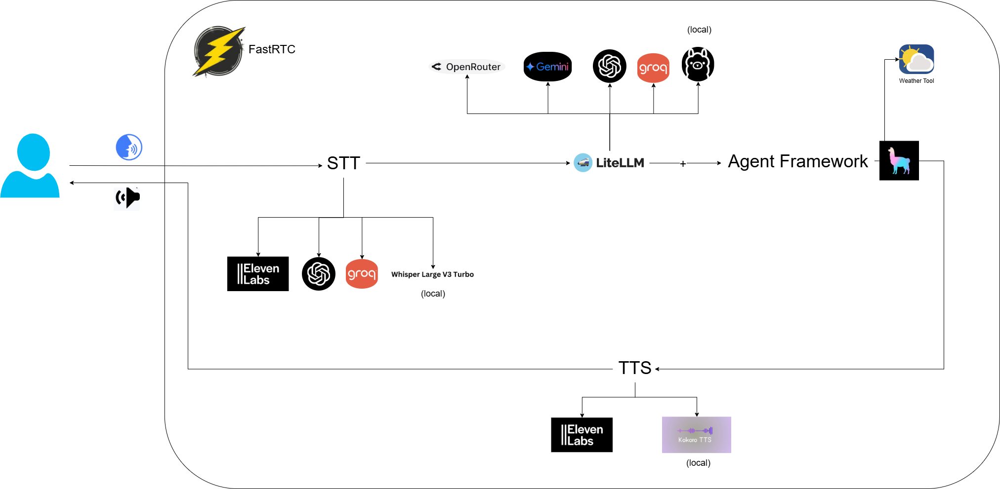

# 🎙️ FastRTC Voice Agent

A model-agnostic voice-enabled AI assistant that can engage in natural conversations. The project combines FastRTC for real-time communication, multiple speech services, and LiteLLM for flexible model support.

## ⚙️ How it Works

1. The system captures your voice input
2. Converts speech to text using your configured STT provider
3. Sends the text to your configured LLM via LiteLLM
4. Converts the response to speech using your configured TTS provider
5. Plays back the audio response

## ✨ Features

- Real-time voice conversations in multiple languages
- **Model-agnostic architecture**: Mix and match different providers for each component
- **Intelligent Agent**: LlamaIndex-powered agent with tool usage capabilities
- **Memory Management**: Token-aware conversation history with configurable limits
- Speech-to-Text: ElevenLabs, Groq, OpenAI, Whisper (local)
- Text-to-Speech: ElevenLabs, Kokoro (local)
- Web interface or phone number access (Gradio)
- Fully customizable assistant persona via YAML configuration
- LLM-agnostic: easily switch between OpenAI, Gemini, Groq, Ollama, and OpenRouter
- Automatic fallback to alternative models if primary model fails
- Session-based chat history for context-aware conversations
- Clean, modular class-based architecture
- Environment variables and command-line arguments for flexible configuration

## 🎯 Recommended Configuration

After extensive testing, the following configuration has proven to provide the best balance of latency, accuracy, and overall user experience:

- **Speech-to-Text**: ElevenLabs or Groq (both offer excellent accuracy with low latency)
- **Text-to-Speech**: ElevenLabs (best voice quality and response time)
- **LLM Provider**: Google Gemini (specifically gemini flash (1.5 or 2.5) for fastest responses while maintaining high quality)

This setup minimizes overall latency while maintaining high accuracy in speech recognition and natural-sounding responses.

## 🏗️ Architecture



The project follows a modular class-based design with multiple components working together to provide a seamless voice interaction experience:

1. **FastRTC**: Handles real-time voice communication
2. **Speech Services**:
   - **STT (Speech-to-Text)**: Supports ElevenLabs, OpenAI, Groq, and local Whisper
   - **TTS (Text-to-Speech)**: Supports ElevenLabs and local Kokoro TTS
3. **LiteLLM**: Provides unified access to multiple LLM providers:
   - OpenRouter
   - Google Gemini
   - OpenAI
   - Groq
   - Local Ollama
4. **Agent Framework**: A Llamaindex ReAct agent orchestrates the conversation flow with:
   - Weather Tool integration (example)
   - Memory management

## 🛠️ Agent Configuration

The agent can be configured through environment variables and YAML files:

### System Prompts
Located in `config/prompts.yaml`:
```yaml
system_prompts:
  weather_expert: |
    You are a helpful weather expert assistant...
  chef_assistant: |
    You are a knowledgeable cooking assistant...
```

### Tools Configuration
The agent supports various tools that can be enabled/disabled:
```python
# Example tool configuration
tools = [
    {
        "name": "get_weather",
        "description": "Get current weather in a location"
    }
]
```

### Memory Settings
```python
# Token limits for conversation history
MEMORY_TOKEN_LIMIT=4000        # Total memory token limit
CHAT_HISTORY_RATIO=0.8         # Ratio for chat history (80% of total)
```

## 🔧 Prerequisites
- API keys for your preferred providers
- Microphone
- For local models: Ollama installed and running

## 🧩 Provider Configuration Examples

### 🌐 Recommended Cloud Setup
Using the optimal configuration for best performance:

```
# Speech service
TTS_PROVIDER=elevenlabs
STT_PROVIDER=groq        # or elevenlabs, both perform excellently

# LLM (fastest responses with high quality)
LLM_PROVIDER=gemini
GEMINI_MODEL=gemini-1.5-flash
```

### 💻 Full Local Setup
Running everything locally:

```
# Speech service
TTS_PROVIDER=kokoro
STT_PROVIDER=whisper

# LLM
LLM_PROVIDER=ollama
OLLAMA_MODEL=llama3.1:8b
OLLAMA_API_BASE=http://localhost:11434
```

### 🔄 Hybrid Setup (Local LLM, Cloud Speech)
Local LLM with cloud speech services:

```
# Speech service
TTS_PROVIDER=elevenlabs
STT_PROVIDER=elevenlabs

# LLM
LLM_PROVIDER=ollama
OLLAMA_MODEL=llama3.1:8b
```

### 🔄 Hybrid Setup (Cloud LLM, Mixed Speech)
Cloud LLM with mixed speech services:

```
# Speech service
TTS_PROVIDER=kokoro  # Local TTS
STT_PROVIDER=openai  # Cloud STT

# LLM
LLM_PROVIDER=openai
OPENAI_LLM_MODEL=gpt-3.5-turbo
```

## 🔄 Speech Service Configuration

The system supports multiple providers for speech-to-text, text-to-speech and LLMs:

### 🎤 Speech-to-Text Providers

#### ElevenLabs
```
STT_PROVIDER=elevenlabs
ELEVENLABS_API_KEY=your_elevenlabs_api_key
ELEVENLABS_STT_MODEL=scribe_v1
ELEVENLABS_STT_LANGUAGE=ita
```

#### Groq
```
STT_PROVIDER=groq
GROQ_API_KEY=your_groq_api_key
GROQ_STT_MODEL=whisper-large-v3-turbo
GROQ_STT_LANGUAGE=it
```

#### OpenAI
```
STT_PROVIDER=openai
OPENAI_API_KEY=your_openai_api_key
OPENAI_STT_MODEL=gpt-4o-transcribe
OPENAI_STT_LANGUAGE=it
```

#### Whisper (Local)
```
STT_PROVIDER=whisper
WHISPER_MODEL_SIZE=large-v3
WHISPER_LANGUAGE=it
```

### 🔊 Text-to-Speech Providers

#### ElevenLabs
```
TTS_PROVIDER=elevenlabs
ELEVENLABS_API_KEY=your_elevenlabs_api_key
ELEVENLABS_VOICE_ID=JBFqnCBsd6RMkjVDRZzb
ELEVENLABS_TTS_MODEL=eleven_multilingual_v2
ELEVENLABS_LANGUAGE=it
```

#### Kokoro
```
TTS_PROVIDER=kokoro
KOKORO_VOICE=im_nicola
KOKORO_LANGUAGE=i
TTS_SPEED=1.0
```

## 🧠 LLM Configuration

This project uses LiteLLM to support multiple LLM providers. Configure your preferred model in the `.env` file:

### Local Models with Ollama

```
LLM_PROVIDER=ollama
OLLAMA_MODEL=llama3.1:8b
OLLAMA_API_BASE=http://localhost:11434
```

### Cloud Models

#### OpenAI
```
LLM_PROVIDER=openai
OPENAI_API_KEY=your_key_here
OPENAI_LLM_MODEL=gpt-3.5-turbo
```

#### Google Gemini
```
LLM_PROVIDER=gemini
GEMINI_API_KEY=your_key_here
GEMINI_MODEL=gemini-1.5-flash
```

#### Groq
```
LLM_PROVIDER=groq
GROQ_API_KEY=your_key_here
GROQ_LLM_MODEL=llama-3.1-8b-instant
```

#### OpenRouter (access to many models)
```
LLM_PROVIDER=openrouter
OPENROUTER_API_KEY=your_key_here
OPENROUTER_MODEL=qwen/qwq-32b:free
```

### Model Fallbacks

You can specify fallback models in case your primary model fails:

```
LLM_FALLBACKS=gpt-3.5-turbo,ollama/llama3.1:8b
```

## 🚀 How to use

1. Clone the repository and navigate to the project directory

2. Create and activate a virtual environment:
   ```bash
   python -m venv .venv
   # On Windows
   .venv\Scripts\activate
   # On Unix/MacOS
   source .venv/bin/activate
   ```

3. Install dependencies:
   ```bash
   pip install -r requirements.txt
   ```

4. Set up environment variables:
   ```bash
   cp .env_example .env
   # Edit .env and add your API keys and model settings
   ```

5. Run the application:
   ```bash
   # Default configuration from .env
   python main.py

   # Override with command-line arguments:
   # Use Kokoro TTS with a specific voice and speed
   python main.py --tts kokoro --voice im_nicola --speed 1.0
   # Use OpenAI for speech recognition
   python main.py --stt openai --tts elevenlabs
   # Use local Whisper for speech recognition
   python main.py --stt whisper --tts kokoro
   ```
   Or get a temporary phone number for voice calls:
   ```bash
   python main.py --phone
   ```

## ✅ Todo

### completed
- [x] multiple tts providers (elevenlabs, kokoro)
- [x] multiple stt providers (elevenlabs, groq, openai)
- [x] session-based chat history
- [x] model fallback mechanism
- [x] environment variable and command-line configuration
- [x] web interface (gradio)
- [x] phone number access
- [x] multi-language support
- [x] modular class-based architecture
- [x] local stt provider support

### remaining
- [ ] custom agents with tools
- [ ] custom web ui
- [ ] voice activity detection improvements
- [ ] noise sound resiliency improvements
- [ ] perform tts in chuncks whenever the LLM response is too long
- [ ] add unit tests
- [ ] docker containerization

## 🤝 how to contribute

contributions are very welcome! :)

### submitting a pull request

1. fork the repository and create your branch from `main`:
   ```bash
   git clone https://github.com/yourusername/fastrtc-voice-agent.git
   cd fastrtc-voice-agent
   git checkout -b feature/your-feature-name
   ```

2. make your changes 

4. commit your changes with descriptive messages:
   ```bash
   git commit -m "add: new feature description"
   ```

5. push to your branch:
   ```bash
   git push origin feature/your-feature-name
   ```

6. open a pull request with title and description:
   - describe what your pr adds or fixes
   - reference any related issues
   - explain your implementation approach